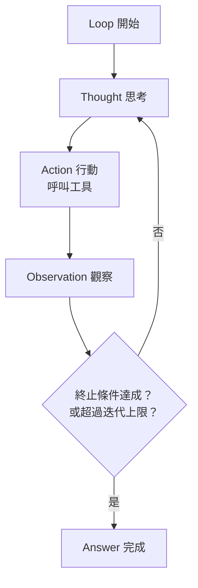
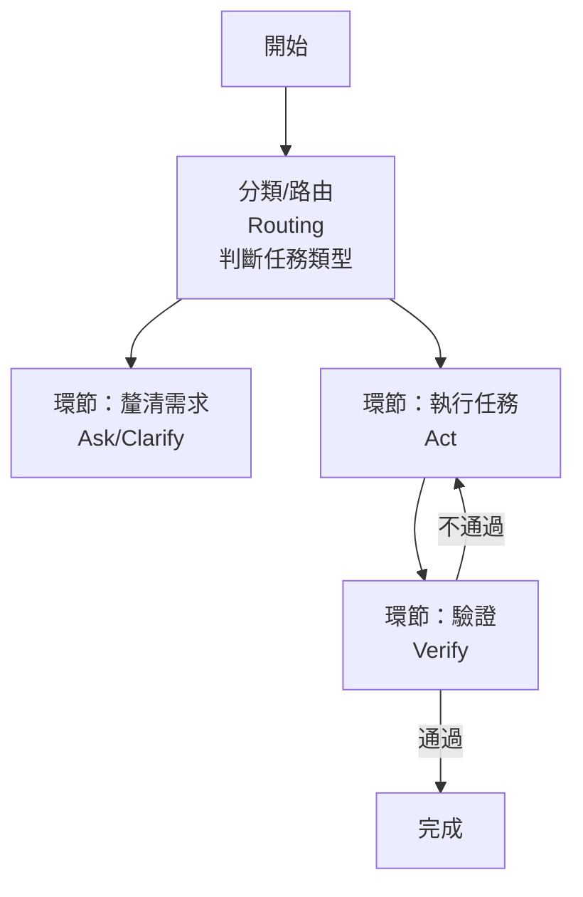

# 9.5 從提示工程到 Loop 工程到 Graph 工程

## 不斷往「外側」移動的工程

前面幾章我們看到一條清晰的演進線：Agent 工程的重心，從「內核」逐步往外「外側」移動——也就是**從「模型本身」，走向「包住模型的框架」**。

本節把這條演進線完整地串起來，它其實是本書第二篇的一張「地圖」：

> **Prompt Engineering（提示工程）→ Context Engineering（上下文工程）→ Harness Engineering（韁繩工程）→ Loop Engineering（迴圈工程）→ Graph Engineering（圖工程）**

這條路線圖反映了一個深刻的趨勢：**當模型能力快速進步，工程師真正能「設計與控制」的部分，越來越在外側。** 內核（模型參數）幾乎無法由你控制，越是外面、越是你能著力、也是穩定性的來源。

## 六個階段的演進

| 階段 | 聚焦 | 描繪 |
|------|------|------|
| **Prompt 工程**（7.1） | 怎麼把指令寫好 | 單次、靜態的「問」 |
| **Context 工程**（7 章） | 讓模型看到對的資訊 | 管理「上下文的組成與品質」 |
| **Harness 工程**（9.1-9.4） | 提供並限制工具與安全 | Constrain / Verify / Correct |
| **Loop 工程**（本節） | 設計「執行的迴圈」 | 何時、以何種順序呼叫模型與工具 |
| **Graph 工程**（本節） | 設計「多環節的圖」 | 多個環節/多個模型如何協作 |
| **（更外側）評估與進化**（10 章） | 證明「做得好」並持續改進 | 度量、迭代、學習 |

**共同主軸**：每一階段，都把「可控制、可驗證」的層次推向更外側。這與 1.4 節「本質性困難由人掌握」、14.2 節「Harness 與模型共同演進」深深呼應。

## Loop 工程：設計「執行迴圈」

**Loop 工程（迴圈工程）** 關注的是：**「拿模型與工具，組一個『迴圈』，讓它週而復始地思考、行動、觀察，直到完成任務。」**

ReAct（8.4 節）就是一個基礎的 Loop。但「工程化」的 Loop 不只是「無腦循環」，而是要設計：

- **迴圈的結構**：何時該呼叫 LLM、何時該呼叫工具、何時該終止
- **終止條件**：何時算「完成」？（答對、測試通過、使用者確認）
- **迭代的上限**：最多繞幾圈？（防止無限循環）
- **思考/行動的比例**（8.4 節）：多想少動，還是多動快試
- **狀態管理**：迴圈每一圈的上下文如何更新（7.4 節）

**Loop 工程的價值**：把「一次性的 Prompt」變成「可重複、受控、可終止的執行過程」——這是從「問一個問題」到「完成一個任務」的關鍵一步。

## Graph 工程：從「一條迴圈」到「多個環節」

當任務變複雜，單一迴圈往往不夠。**Graph 工程（圖工程）**把 Agent 的執行，從「一條順序迴圈」擴展為「一個『圖』（Graph）」——其中含**多個環節（節點）**，每個環節是「模型呼叫」或「工具動作」，並依**流程邏輯**（順序、條件、並行、迴圈）連接。

這其實呼應了 4.4 節的 Agentic Coding 流程圖、以及 11 章的多 Agent 協作——**複雜任務被拆成許多可獨立設計與驗證的環節，再接成一個有向圖。**

**常見的圖結構**（可與 11 章連結）：
- **Routing（路由）**：依輸入分派到不同子流程
- **Parallel（並行）**：多個獨立環節同時執行
- **Evaluator（評估者）**：一個環節評估並修正另一個的輸出（LLM-as-a-Judge，5.5 節）
- **Loop（迴圈）**：如 ReAct 般的迭代環節

**Graph 工程的價值**：把複雜任務「**結構化、可視化、可測試**」——每個環節都能單獨設計與評估，整體流程能畫成圖、能除錯、能追蹤。這是「Harness」從「單迴圈」走向「多環節圖」的自然擴展。

## 從 Loop 到 Graph：穩定性的外移

理解這條演進線，最關鍵的一點是：

> **真正「可被工程師控制與驗證」的，是外側的 Loop 與 Graph 結構，而不是內核的模型參數。**

- **模型**（最內側）：黑箱，你控制不了它的參數
- **Prompt/Context**：你能影響它「看到什麼」
- **Harness/Loop/Graph**（外側）：你能設計「怎麼執行、如何繞圈、如何連接、如何驗證」

**因此**：Agent 工程的功力，越來越體現在**「會不會設計好外側的 Loop 與 Graph」**——也就是**能不能把複雜任務拆成可驗證的環節、接成可控制的圖、配上可靠的 Harness**。這是一門「**結構化的工程**」，而不是「碰運氣的提示」。

## 回到全書主軸

最後，把這條演進線與全書連結：

- **第 1 章**：本質性困難（需求、複雜性、品質）在人，不因 AI 而消失
- **第 7-9 章**：工程重心移到「上下文、工具、Harness、Loop、Graph」這些「外側可控制層」
- **第 10 章**：這些外側設計「好不好」，最終要靠**評估**來度量並持續改進
- **第 14 章**：模型持續內化能力，Harness 與 Loop/Graph 會「共同演進」（14.2 節）

**一句話**：**當你可以控制「怎麼把任務拆成環節、怎麼連接、怎麼驗證」，而不必糾結「模型會不會」，你就真正掌握了 AI 時代的軟體工程。** 這正是本書要傳達的核心能力轉移。

## 本章小結

- 演進線：**Prompt → Context → Harness → Loop → Graph 工程**（再到評估/進化）
- 趨勢：工程重心**不斷往外側移動**——外面你可控制、是穩定性的來源
- **Loop 工程**：設計執行迴圈（結構、終止條件、上限、思考/行動比例）
- **Graph 工程**：把複雜任務拆成多環節的「圖」（路由/並行/評估者/迴圈）
- 核心洞察：**可控制與驗證的是外側結構，不是內側模型**
- 功力在「**把任務拆成可驗證的環節、接成可控的圖、配上可靠的 Harness**」

## 想一想

1. 為什麼 Agent 工程的「可控制部分」會不斷往模型的外側移動？內核（參數）為什麼難控制？
2. 對照你的 Coding Agent 任務，畫出它的一個「Loop」，並指出它的終止條件與迭代上限。
3. 舉一個需要「Graph 工程」的複雜任務（例如「撰寫並測試一個新模組」），把它拆成「環節的圖」，並標出哪些環節需要 LLM-as-a-Judge 或測試來驗證。
