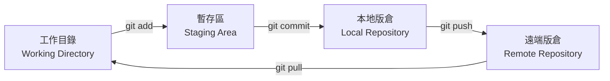

# A.1 版本控制的本質：為什麼需要 Git

## 什麼是版本控制

在撰寫報告或程式碼時，你是否遇過這樣的狀況：改了半天覺得還是舊版比較好，結果舊版早已被覆蓋而無法復原？或者多人合作時，兩個人同時修改同一個檔案，最後不知道該保留誰的版本？

**版本控制系統（Version Control System, VCS）** 就是用來解決這些問題的工具。它的核心功能是：記錄檔案在時間上的每一次變化，讓你能夠在任何時刻回到過去的任何一個版本，也能讓多人在同一個專案中並行工作而不互相衝突。

最直覺的版本控制方式是手動備份：

```
project/
project_v2/
project_final/
project_final_final/
project_final_final_REAL/
```

這種做法很快就會失控。版本控制系統提供了一套結構化的方法來管理這些變更。

## 本地端 vs 分散式版本控制

早期的版本控制系統（如 CVS、SVN）採用**集中式架構**：所有版本資料存放在一台中央伺服器上，開發者必須連線到伺服器才能提交變更或查看歷史紀錄。這意味著一旦伺服器掛掉，所有人就無法工作。

**分散式版本控制系統（DVCS）** 則完全不同。以 Git 為例，每一位開發者的電腦上都有一份完整的版本庫（repository）副本，包含所有的歷史紀錄。你不需網路連線就能提交、建立分支、檢視歷史。當網路恢復時，再將變更同步到遠端伺服器即可。

這種架構帶來了幾個關鍵優勢：

- **離線工作**：在飛機上也能正常提交
- **快速**：大部分操作都在本機完成，不需要網路
- **備援**：每個人手上都有一份完整的歷史，任一台電腦故障都不會丟失資料
- **彈性的工作流**：支援各種分支與合併策略

## Git 的誕生背景

Git 由 Linux 之父 Linus Torvalds 在 2005 年所創造，最初是為了管理 Linux 核心原始碼的開發。當時 Linux 核心有數千名貢獻者，變更頻率極高，舊有的版本控制工具（BitKeeper）的授權又出了問題，因此 Linus 決定自己寫一個。

Git 的設計哲學深受 Linux 核心開發模式的影響：

- **效能優先**：即使是大型專案也能快速運作
- **資料完整性**：每個版本都透過 SHA-1 雜湊值來確保內容未被竄改
- **非線性開發**：鼓勵建立分支，讓實驗性質的開發不會干擾主線

## Git 的運作模型

要理解 Git，必須先理解它的三個工作區域：



- **工作目錄（Working Directory）**：你實際編輯檔案的地方。
- **暫存區（Staging Area）**：又稱 index，是你準備好要提交的變更的中繼區。你可以只選擇部分變更加入暫存區，實現精細的提交控制。
- **本地版倉（Local Repository）**：儲存所有已提交的版本歷史。這是在你電腦上的 `.git` 目錄中。
- **遠端版倉（Remote Repository）**：例如 GitHub 上的版本倉，用來與他人同步。

這種設計看起來比直接提交多了一個步驟，但它賦予了你極大的彈性：你可以決定哪些變更要放進同一個提交，從而讓每次提交都有清楚且有意義的目的。

## 為什麼是 Git

目前幾乎所有的軟體開發專案都使用 Git 作為版本控制工具。根據 Stack Overflow 的開發者調查，Git 連續多年穩居最常用的開發工具榜首。GitHub 上有超過 2 億個程式碼版本倉，這意味著學會 Git 是進入軟體工程领域的基本門檻。

Git 不只是工具，它背後代表的是一種**工作哲學**：小步提交、頻繁整合、善用分支進行實驗、透過程式碼審查確保品質。這些觀念將貫穿本書後續的章節。

## 想一想

1. 如果你正在撰寫一篇期末報告，你會如何使用版本控制來管理不同階段的修改？
2. 分散式版本控制相較於集中式版本控制，在「多人同時斷網工作」的情境下有什麼優勢？
3. Git 為什麼要設計「暫存區」這個中間步驟，而不是直接從工作目錄提交到版倉？

## 本章小結

本章介紹了版本控制的基本概念，說明了為什麼手動備份不可行，以及分散式版本控制相對於集中式架構的優勢。我們也了解了 Git 的誕生背景與設計哲學，以及它獨特的三區模型（工作目錄、暫存區、本地版倉）。下一章我們將動手實際操作 Git，從建立版本倉開始，一步步學會基本指令。
