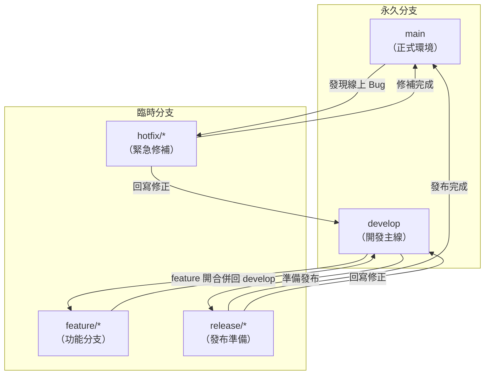
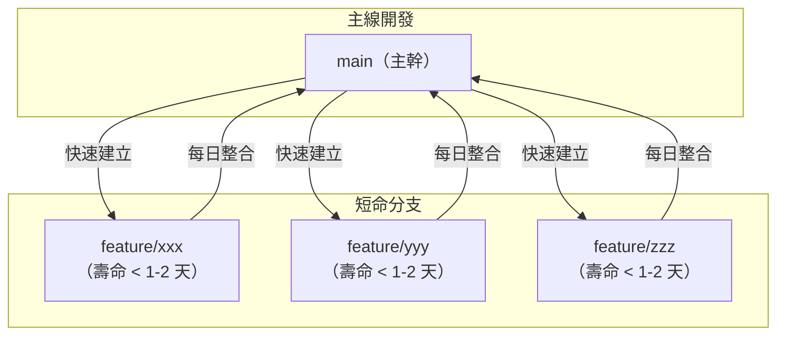

# A.3 分支策略：Git Flow 與 Trunk-Based Development

## 為什麼需要分支策略

在上一章我們學會了建立分支和合併。但當專案規模增大、團隊人數增多時，「什麼時候該建立分支」、「分支該如何命名」、「合併回主線的時機」等問題就會變得複雜。沒有明確的分支策略，團隊很容易陷入混亂：分支堆積如山沒人清理、主線長期處於不可發布的狀態、合併時衝突多到無法處理。

**分支策略（branching strategy）** 是團隊共同約定的工作流程，規定了分支的命名規則、用途、生命週期以及合併時機。本章介紹兩種最具代表性的策略：Git Flow 與 Trunk-Based Development。

## Git Flow

Git Flow 由 Vincent Driessen 在 2010 年提出，是最經典的分支策略之一。它定義了五種分支類型：



**五種分支說明：**

- **main**：永遠反映正式環境（production）的狀態，每次提交都對應一個發布版本。
- **develop**：日常開發的整合分支，所有功能完成後先合併到這裡。
- **feature/xxx**：從 `develop` 分出，開發完成後合併回 `develop`。例如 `feature/user-login`。
- **release/xxx**：從 `develop` 分出，用來準備下一個版本的發布（寫文件、改版本號等），完成後同時合併到 `main` 和 `develop`。
- **hotfix/xxx**：從 `main` 分出，用來修復正式環境的緊急 Bug，修完後同時合併到 `main` 和 `develop`。

### Git Flow 操作範例

```bash
# 開始新功能
git checkout develop
git checkout -b feature/user-login

# 開發中...
echo "login code" > login.py
git add .
git commit -m "實作使用者登入功能"

# 功能完成，合併回 develop
git checkout develop
git merge --no-ff feature/user-login
git branch -d feature/user-login

# 準備發布
git checkout -b release/1.0.0 develop
echo "1.0.0" > VERSION
git add VERSION
git commit -m "設定版本號 1.0.0"

# 發布
git checkout main
git merge --no-ff release/1.0.0
git tag -a v1.0.0 -m "版本 1.0.0"
git checkout develop
git merge --no-ff release/1.0.0
git branch -d release/1.0.0
```

`--no-ff` 代表「不使用快速合併（fast-forward）」，強制產生一個合併提交，讓分支歷史更清楚。

### Git Flow 的適用場景

Git Flow 適合有明確版本發布週期的專案，例如：

- 手機 App（需要通過應用商店審核才能發布）
- 套件或函式庫（有語意化版本號的管理需求）
- 嵌入式系統（發布後不易更新）

但對於需要持續部署的 Web 服務，Git Flow 的多分支模型可能顯得過重。

## Trunk-Based Development

Trunk-Based Development（TBD）是一種更簡潔的策略，核心概念只有一句話：**所有人直接往主幹（trunk/main）提交，保持主幹隨時可發布。**



**TBD 的關鍵實踐：**

- **短命分支**：即使建立功能分支，也應在一到兩天內完成並合併回主線，避免長時間分叉。
- **功能標記（Feature Flag）**：尚未完成的功能用程式碼中的開關隱藏，而非用分支隔離。
- **頻繁整合**：每位開發者至少每天整合一次，減少合併衝突。
- **主幹永遠可發布**：任何時刻從 `main` 取出的程式碼都应该能直接部署到正式環境。

### TBD 操作範例

```bash
# 從主幹建立短命分支
git checkout main
git checkout -b fix-typo-123

# 小幅度修改並提交
echo "fixed" > fix.txt
git add .
git commit -m "修正登入頁面錯字"

# 快速合併回主幹（1-2 天內）
git checkout main
git merge fix-typo-123
git branch -d fix-typo-123

# 立即推送
git push origin main
```

### TBD 的適用場景

- 持續交付（Continuous Delivery）的 Web 服務
- 雲端 SaaS 應用
- 大型團隊的快速迭代

Google、Facebook、Microsoft 等公司都採用類似 TBD 的開發模式。事實上，TBD 需要較成熟的工程實踐（如完善的自動化測試、功能標記機制）作為後盾，否則「主幹永遠可發布」會變成空談。

## 兩種策略的比較

| 面向 | Git Flow | Trunk-Based Development |
|------|----------|------------------------|
| 分支數量 | 多（五種類型） | 少（最多一種） |
| 分支生命週期 | 長（數週至數月） | 短（數小時至數天） |
| 合併頻率 | 低（里程碑式合併） | 高（每日整合） |
| 適用場景 | 有版本發布週期的專案 | 持續部署的服務 |
| 學習門檻 | 較高 | 較低 |
| 需要的工程基礎 | 較少 | 需要完善的自動化測試 |

## 如何選擇

沒有「最好」的分支策略，只有「最適合」的。選擇時考量以下因素：

1. **發布頻率**：如果是每日部署，TBD 更合適；如果是一季發布一次，Git Flow 的結構化管理更有價值。
2. **團隊規模**：小團隊（3-5 人）用 TBD 較輕量；大團隊或跨團隊合作可能需要 Git Flow 的明確分工。
3. **工程成熟度**：TBD 需要強大的自動化測試和 CI/CD 管線來確保主幹品質；如果測試覆蓋率不足，強行用 TBD 可能導致正式環境頻繁出錯。

## 想一想

1. 如果一個 App 專案需要同時維護三個版本（v1.x、v2.x、v3.x），Git Flow 還足夠嗎？可能需要什麼樣的調整？
2. 為什麼 Google 這種超大團隊可以使用 Trunk-Based Development？他們需要哪些工程實踐來支撐？
3. 如果你的課程專案只有一週的開發時間，你會選擇哪種分支策略？為什麼？

## 本章小結

本章介紹了兩種最具代表性的分支策略：Git Flow 以結構化的多分支模型管理版本發布，適合有明確發版週期的專案；Trunk-Based Development 則以簡潔的單主幹模式追求持續整合與部署，適合需要快速交付的服務。選擇分支策略時應綜合考量發布頻率、團隊規模與工程成熟度。下一章將進入 GitHub 的協作流程，學習如何透過 Pull Request 和 Code Review 與團隊成員高效合作。
