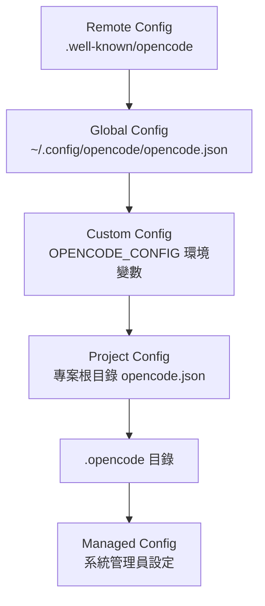

# B.2 安裝與設定 OpenCode Desktop

## 安裝 OpenCode

OpenCode 提供多種安裝方式，以下依作業系統分別說明。本節以 Desktop 版為主要介面，同時介紹 CLI 的安裝方式。

### macOS

**Desktop 版**

1. 前往 https://opencode.ai/download
2. 下載 macOS 版安裝程式（.dmg 檔案）
3. 開啟 .dmg 檔案，將 OpenCode 拖入 Applications 資料夾
4. 首次開啟時，macOS 可能會顯示安全警告。前往「系統設定 > 隱私與安全性」，點選「仍要開啟」

**CLI 版（終端機安裝）**

使用一鍵安裝腳本：

```bash
curl -fsSL https://opencode.ai/install | bash
```

或使用 Homebrew：

```bash
brew install anomalyco/tap/opencode
```

安裝完成後，在終端機輸入 `opencode` 即可啟動 TUI 介面。

### Windows

**Desktop 版**

1. 前往 https://opencode.ai/download
2. 下載 Windows 版安裝程式
3. 執行安裝程式，依指示完成安裝

**CLI 版**

官方建議在 Windows 上使用 WSL（Windows Subsystem for Linux）以獲得最佳體驗。若使用 WSL，可直接使用 Linux 的安裝指令。若在原生 Windows 環境，可使用：

```bash
# 使用 Chocolatey
choco install opencode

# 使用 Scoop
scoop install opencode

# 使用 npm
npm install -g opencode-ai
```

### Linux

**Desktop 版**

前往 https://opencode.ai/download 下載對應發行版的安裝套件。

**CLI 版**

```bash
# 一鍵安裝
curl -fsSL https://opencode.ai/install | bash

# 使用 npm
npm install -g opencode-ai

# Arch Linux
sudo pacman -S opencode
```

## 設定 LLM Provider

安裝完成後，你需要設定至少一個 LLM Provider 才能開始使用。

### 使用 OpenCode Zen（推薦新手）

OpenCode Zen 是官方提供的精選模型服務，已由團隊測試與驗證，不需要自行管理多個 Provider 的 API Key。

1. 在 TUI 中執行 `/connect` 指令，選擇 `opencode`
2. 瀏覽器會開啟 https://opencode.ai/auth
3. 登入後新增付費資訊，複製 API Key
4. 回到 TUI 貼上 API Key

### 使用其他 Provider

如果你已有其他 Provider 的 API Key（如 Anthropic、OpenAI、Google），也可以直接設定。常見的環境變數設定方式：

```bash
export ANTHROPIC_API_KEY="your-api-key-here"
export OPENAI_API_KEY="your-api-key-here"
export GEMINI_API_KEY="your-api-key-here"
```

## 設定配置檔

OpenCode 使用 JSON 格式的配置檔，支援兩個層級：

### 全域設定

全域設定檔位於 `~/.config/opencode/opencode.json`，對所有專案生效：

```json
{
  "$schema": "https://opencode.ai/config.json",
  "model": "anthropic/claude-sonnet-4-5",
  "autoupdate": true,
  "permission": {
    "edit": "ask",
    "bash": "ask"
  }
}
```

### 專案設定

在專案根目錄放置 `opencode.json`，僅對該專案生效，且優先於全域設定：

```json
{
  "$schema": "https://opencode.ai/config.json",
  "model": "anthropic/claude-sonnet-4-5",
  "instructions": ["CONTRIBUTING.md", "docs/coding-standards.md"],
  "formatter": true,
  "lsp": true
}
```

配置檔的優先順序（由低到高）如下：



設定檔使用合併（merge）策略：不同層級的設定會合併在一起，僅在鍵名衝突時才會覆蓋。

## 初始化 AGENTS.md

設定好 Provider 後，建議為專案建立 `AGENTS.md` 檔案。在專案目錄中執行：

```
/init
```

此指令會分析專案結構，自動產生一份 `AGENTS.md`，包含建構指令、測試指令、專案架構說明等資訊。建議將此檔案納入版本控制，與團隊共享。

若你已有 `CLAUDE.md`（Claude Code 的規則檔），OpenCode 會自動讀取作為備援，無需重複建立。

## 常用 Desktop 操作

- **Tab 鍵** —— 切換 Agent 模式（Build / Plan）
- **@ 符號** —— 搜尋專案檔案並附加到對話中
- **`/init`** —— 初始化 AGENTS.md
- **`/undo`** —— 還原上一次的檔案變更
- **`/redo`** —— 重做被還原的變更
- **`/share`** —— 分享對話連結

## 想一想

1. 全域設定與專案設定之間是什麼關係？為什麼需要兩層設定？
2. 為什麼建議將 `AGENTS.md` 納入 Git 版本控制？
3. 你認為 `permission` 設為 `"ask"`（每次詢問）和 `"allow"`（自動執行）各適合什麼場景？

## 本章小結

本章涵蓋了 OpenCode 在 macOS、Windows、Linux 上的安裝方式，以及 LLM Provider 的設定方法。我們介紹了全域設定檔（`~/.config/opencode/opencode.json`）與專案設定檔（`opencode.json`）的差異與合併機制，並說明了如何透過 `/init` 指令快速建立 `AGENTS.md`。下一章將深入介紹 `AGENTS.md` 的撰寫方法。
