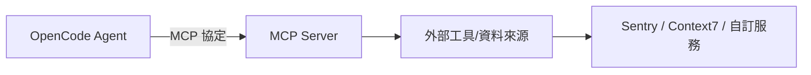

# B.5 MCP Servers：擴展 AI 的工具箱

## 什麼是 MCP

Model Context Protocol（MCP）是一個開放協定，用於擴展 AI Agent 的能力。你可以把它想像成「AI 的 USB 接口」——透過標準化的協定，將外部工具與資料來源接入 OpenCode，讓 AI Agent 能存取原本無法觸及的資源。

MCP Server 可以是本地運行的程式，也可以是遠端服務。一旦設定完成，MCP 提供的工具會自動出現在 Agent 的可用工具清單中，與內建工具（如檔案讀寫、Shell 執行）並列使用。

## MCP 的運作原理



當 Agent 需要使用某個 MCP 工具時，它會透過 MCP 協定向對應的 Server 發送請求。Server 處理請求後回傳結果，Agent 再將結果納入後續的推理過程。

## 設定本地 MCP Server

在 `opencode.json` 中的 `mcp` 區塊設定：

```json
{
  "$schema": "https://opencode.ai/config.json",
  "mcp": {
    "mcp_everything": {
      "type": "local",
      "command": ["npx", "-y", "@modelcontextprotocol/server-everything"],
      "enabled": true
    }
  }
}
```

更多本地 MCP Server 的設定選項：

```json
{
  "mcp": {
    "my-local-server": {
      "type": "local",
      "command": ["npx", "-y", "my-mcp-command"],
      "cwd": ".",
      "enabled": true,
      "environment": {
        "MY_API_KEY": "{env:MY_API_KEY}"
      },
      "timeout": 10000
    }
  }
}
```

| 選項 | 說明 |
|---|---|
| `type` | 固定為 `"local"` |
| `command` | 啟動 MCP Server 的命令與參數（陣列格式） |
| `cwd` | 工作目錄，相對路徑從專案目錄解析 |
| `environment` | 環境變數 |
| `enabled` | 是否啟用（預設 true） |
| `timeout` | 取得工具清單的逾時時間（毫秒），預設 5000 |

## 設定遠端 MCP Server

```json
{
  "mcp": {
    "my-remote-mcp": {
      "type": "remote",
      "url": "https://my-mcp-server.com/mcp",
      "enabled": true,
      "headers": {
        "Authorization": "Bearer MY_API_KEY"
      }
    }
  }
}
```

遠端 MCP Server 也支援 OAuth 認證。設定為遠端 Server 後，首次使用時 OpenCode 會自動偵測 401 回應並啟動 OAuth 流程。

## 實用範例

### Context7 —— 文件搜尋

Context7 提供即時的技術文件搜尋，讓 Agent 能查到最新的框架用法：

```json
{
  "mcp": {
    "context7": {
      "type": "remote",
      "url": "https://mcp.context7.com/mcp"
    }
  }
}
```

使用時在 prompt 中加上 `use context7`：

```
Configure a Cloudflare Worker script to cache JSON API responses
for five minutes. use context7
```

### Sentry —— 錯誤追蹤

```json
{
  "mcp": {
    "sentry": {
      "type": "remote",
      "url": "https://mcp.sentry.dev/mcp",
      "oauth": {}
    }
  }
}
```

設定後執行 `opencode mcp auth sentry` 完成 OAuth 認證，即可在對話中查詢專案的錯誤資訊。

### Grep by Vercel —— GitHub 程式碼搜尋

```json
{
  "mcp": {
    "gh_grep": {
      "type": "remote",
      "url": "https://mcp.grep.app"
    }
  }
}
```

使用時加上 `use the gh_grep tool`：

```
What's the right way to set a custom domain in an SST Astro
component? use the gh_grep tool
```

## 管理 MCP 工具的啟用與停用

你可以在 `tools` 區塊中控制特定 MCP 工具的啟用狀態：

```json
{
  "mcp": {
    "my-mcp-foo": {
      "type": "local",
      "command": ["npx", "-y", "my-mcp-foo"]
    },
    "my-mcp-bar": {
      "type": "local",
      "command": ["npx", "-y", "my-mcp-bar"]
    }
  },
  "tools": {
    "my-mcp*": false
  }
}
```

上例使用萬用字元 `my-mcp*` 一次停用所有以 `my-mcp` 為前綴的 MCP 工具。

你也可以針對特定 Agent 啟用：

```json
{
  "tools": {
    "my-mcp*": false
  },
  "agent": {
    "my-agent": {
      "tools": {
        "my-mcp*": true
      }
    }
  }
}
```

## 注意事項

MCP Server 的工具會佔用 LLM 的上下文空間。如果啟用了太多 MCP Server，可能導致上下文溢位，影響 Agent 的回應品質。建議：

- 只啟用當前專案實際需要的 MCP Server
- 使用 `enabled: false` 暫時停用不需要的 Server
- 需要時再在 prompt 中明確指示 Agent 使用特定 MCP 工具

## 想一想

1. MCP 與直接在程式中呼叫 API 有什麼差異？MCP 的優勢在哪裡？
2. 如果你要為學校的選課系統設計一個 MCP Server，它會提供哪些工具？
3. 為什麼 MCP Server 的工具數量不宜太多？這與 LLM 的什麼限制有關？

## 本章小結

MCP（Model Context Protocol）是一個用於擴展 AI Agent 能力的開放協定。透過在 `opencode.json` 中設定 `mcp` 區塊，你可以接入本地或遠端的 MCP Server，讓 Agent 存取外部工具與資料來源。常見的 MCP Server 包括 Context7（文件搜尋）、Sentry（錯誤追蹤）、Grep（程式碼搜尋）等。使用時應注意 MCP 工具對上下文空間的影響，適度啟用即可。
