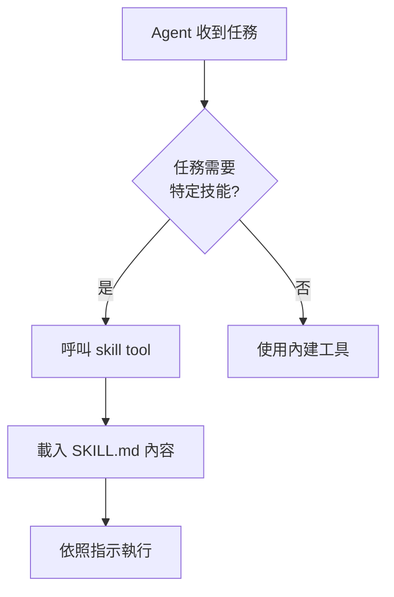

# B.6 Skills：教 AI 新技能

## 什麼是 Skill

在 OpenCode 中，Skill 是一種可重用的行為定義。它就像一份「操作手冊」——你把特定任務的步驟、規則、範例寫成一份 `SKILL.md` 文件，Agent 在需要時會自動發現並載入這份手冊，依照裡面的指示工作。

Skill 與 `AGENTS.md` 的差異在於：`AGENTS.md` 是每次對話都會載入的「通用規則」，而 Skill 是按需載入的「專門技能」。這避免了把所有資訊塞進上下文，節省 token 空間。

## Skill 的存放位置

OpenCode 會從以下位置搜尋 Skill：

| 位置 | 適用範圍 |
|---|---|
| `.opencode/skills/<name>/SKILL.md` | 專案專屬 |
| `~/.config/opencode/skills/<name>/SKILL.md` | 個人全域 |
| `.claude/skills/<name>/SKILL.md` | 專案（相容 Claude Code） |
| `~/.claude/skills/<name>/SKILL.md` | 全域（相容 Claude Code） |
| `.agents/skills/<name>/SKILL.md` | 專案（相容其他 Agent） |
| `~/.agents/skills/<name>/SKILL.md` | 全域（相容其他 Agent） |

每個 Skill 是一個資料夾，裡面包含一個 `SKILL.md` 檔案。資料夾名稱就是 Skill 的名稱。

## 建立第一個 Skill

### 範例：Git Release Skill

建立 `.opencode/skills/git-release/SKILL.md`：

```markdown
---
name: git-release
description: Create consistent releases and changelogs
license: MIT
compatibility: opencode
metadata:
  audience: maintainers
  workflow: github
---

## What I do
- Draft release notes from merged PRs
- Propose a version bump
- Provide a copy-pasteable `gh release create` command

## When to use me
Use this when you are preparing a tagged release.
Ask clarifying questions if the target versioning scheme is unclear.
```

### Frontmatter 規範

`SKILL.md` 的開頭必須包含 YAML frontmatter， recognised 的欄位有：

| 欄位 | 必要 | 說明 |
|---|---|---|
| `name` | 是 | Skill 名稱，1-64 字元，小寫英數與單一連字號 |
| `description` | 是 | 簡短描述，1-1024 字元 |
| `license` | 否 | 授權條款 |
| `compatibility` | 否 | 相容的工具 |
| `metadata` | 否 | 鍵值對的額外資訊 |

`name` 必須符合以下規則：
- 全部小寫，僅能使用英數字與連字號
- 不能以連字號開頭或結尾
- 不能有連續的連字號
- 必須與資料夾名稱一致

正規表達式：`^[a-z0-9]+(-[a-z0-9]+)*$`

## Skill 的發現與載入機制



OpenCode 啟動時會掃描所有 Skill 目錄，將 Skill 的名稱與描述列在 `skill` 工具的說明中。Agent 會看到類似以下的資訊：

```
<available_skills>
  <skill>
    <name>git-release</name>
    <description>Create consistent releases and changelogs</description>
  </skill>
  <skill>
    <name>code-review</name>
    <description>Review code for security and performance issues</description>
  </skill>
</available_skills>
```

當 Agent 判斷某個 Skill 適合當前任務時，它會呼叫：

```
skill({ name: "git-release" })
```

此時 `SKILL.md` 的完整內容會被載入到上下文中，Agent 就會依照裡面的指示工作。

## Skill 的權限控制

你可以在 `opencode.json` 中控制哪些 Skill 可以被使用：

```json
{
  "permission": {
    "skill": {
      "*": "allow",
      "pr-review": "allow",
      "internal-*": "deny",
      "experimental-*": "ask"
    }
  }
}
```

| 動作 | 行為 |
|---|---|
| `"allow"` | 立即載入，無需確認 |
| `"deny"` | 從 Agent 的可用清單中隱藏，拒絕存取 |
| `"ask"` | 載入前要求使用者確認 |

你也可以在個別 Agent 上覆寫 Skill 權限：

```json
{
  "agent": {
    "plan": {
      "permission": {
        "skill": {
          "internal-*": "allow"
        }
      }
    }
  }
}
```

## 社群 Skill 資源

社群已經建立許多實用的 Skill，你可以從以下來源探索與安裝：

- https://skills.sh —— Skill 市場與分享平台
- https://agentskills.io —— Agent Skills 索引

安裝社群 Skill 時，將其 `SKILL.md` 放入對應的 Skill 目錄即可。請注意檢查 Skill 的來源與安全性。

## 實務建議

**為重複性工作建立 Skill。** 如果你發現自己每次都向 Agent 解釋同樣的工作流程（例如「先跑 lint、再跑測試、最後產出報告」），把它寫成 Skill。

**保持 Skill 精簡。** Skill 的內容會佔用上下文空間。一份好的 Skill 應該聚焦在單一任務，避免包太多不相關的內容。

**用具體的指示取代抽象的描述。** 好的 Skill 會清楚列出步驟、範例與邊界條件，讓 Agent 不需要猜測。

## 想一想

1. `AGENTS.md`、Skill、MCP Server 三者各自解決什麼問題？它們之間有什麼互補關係？
2. 如果你要為「撰寫單元測試」這個任務建立一個 Skill，你會在 `SKILL.md` 中寫什麼內容？
3. 為什麼 Skill 要按需載入而非全部預先載入？這與 LLM 的什麼限制有關？

## 本章小結

Skill 是 OpenCode 中可重用的行為定義，透過 `SKILL.md` 檔案描述特定任務的執行步驟與規則。它與 `AGENTS.md` 的差異在於按需載入，節省上下文空間。建立 Skill 時需遵循 frontmatter 規範，將檔案放入指定目錄即可被 Agent 自動發現。社群平台如 skills.sh 與 agentskills.io 提供了豐富的現成 Skill 資源。善用 Skill 能讓 Agent 的工作流程更加標準化與可重複。
